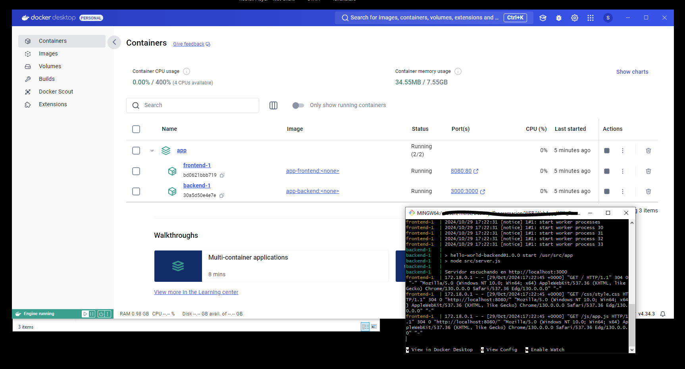
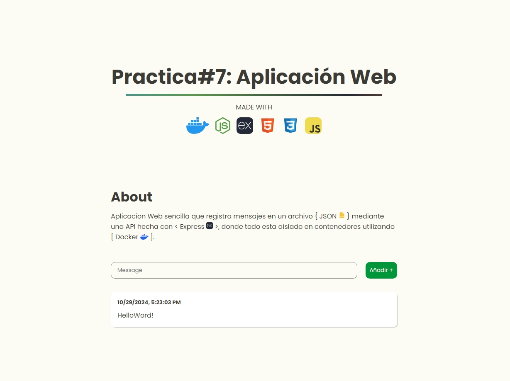

# About
Aplicacion Web sencilla que registra mensajes en un archivo `{ JSON  }` mediante una API hecha con `< Express >`, donde todo esta aislado en contenedores utilizando `[ Docker ]`.

### Real-Time Application

